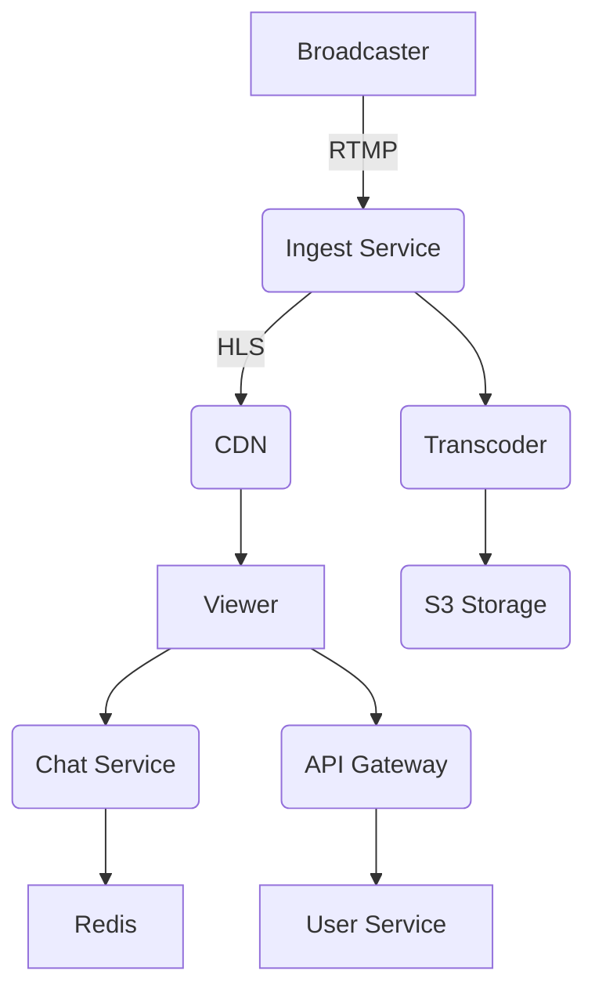

# StreamForge - Live Streaming Platform


StreamForge is a scalable, microservice-based live streaming platform designed to handle high-concurrency video streaming, real-time chat, and interactive features. Inspired by platforms like Twitch and YouTube Live, StreamForge provides a modern, cloud-native solution for live video delivery.

## 🚀 Features

- **High-performance video ingest** (RTMP/HLS/DASH)
- **Adaptive bitrate transcoding** (GPU-accelerated)
- **Real-time chat** with WebSockets
- **Interactive features**: likes, polls, donations
- **User authentication & profiles**
- **Smart recommendations**
- **Scalable analytics**
- **Multi-platform support** (Web, Mobile)

## 📦 Services Overview

| Service              | Tech Stack                          | Description                          |
|----------------------|-------------------------------------|--------------------------------------|
| **Ingest Service**   | Nginx-RTMP, Go                      | RTMP stream ingestion                |
| **Transcoder**       | FFmpeg, GPU acceleration            | Adaptive bitrate conversion          |
| **Chat Service**     | WebSocket, Redis Pub/Sub            | Real-time messaging                  |
| **User Service**     | Go/Spring Boot, JWT, PostgreSQL     | Authentication & profiles            |
| **Analytics**        | Kafka, ClickHouse                   | Real-time viewer metrics             |
| **API Gateway**      | Envoy, gRPC                         | Unified API entrypoint               |

## 🛠️ Getting Started

### Prerequisites

- Docker 20.10+
- Kubernetes cluster (Minikube for local dev)
- Terraform 1.3+
- Helm 3.8+

### Local Development

```bash
# Clone the repository
git clone https://github.com/your-org/streamforge.git
cd streamforge

# Start local cluster (requires minikube)
make local-up

# Deploy services
make deploy-dev

# Access dashboard
minikube dashboard
```

## 🌐 Architecture




## 🚀 Deployment

### Production Setup

1. **Infrastructure Provisioning**:
```bash
cd infra/terraform
terraform init
terraform apply -var-file=prod.tfvars
```

2. **Kubernetes Deployment**:
```bash
helm repo add streamforge https://helm.streamforge.io
helm install streamforge-prod streamforge/streamforge \
  --values charts/values-prod.yaml
```

## 📊 Monitoring

StreamForge includes built-in observability:

- **Metrics**: Prometheus + Grafana
- **Logging**: Loki + Grafana
- **Tracing**: Jaeger

Access dashboards:
```bash
kubectl port-forward svc/grafana 3000:3000
```

## 🤝 Contributing

We welcome contributions! Please see our [Contribution Guidelines](CONTRIBUTING.md).

1. Fork the repository
2. Create your feature branch (`git checkout -b feature/amazing-feature`)
3. Commit your changes (`git commit -m 'Add some amazing feature'`)
4. Push to the branch (`git push origin feature/amazing-feature`)
5. Open a Pull Request

## 📄 License

StreamForge is [Apache 2.0 licensed](LICENSE).

## 📧 Contact

For inquiries, please contact engineering@streamforge.io

---

<p align="center">
  
  <br>
  <strong>Powering the next generation of live streaming</strong>
</p>